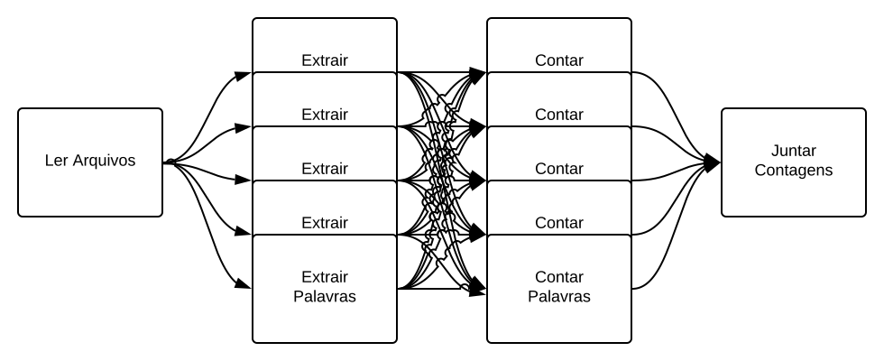
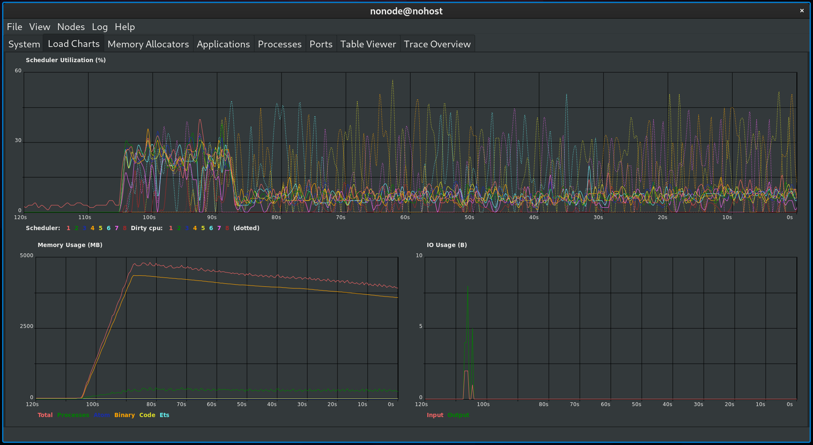

# A demanda por GenStage
## Bernardo Amorim

---

# Contando palavras


---
# Contando palavras

```elixir
defmodule Palavriado do
  @not_char_regex ~r/[^A-Za-z0-9À-ÖØ-öø-ÿ-]/
  @min_word_length 3
  @original_files Path.wildcard("../machado/txt/*.txt")
  @files List.flatten(List.duplicate(@original_files, 10))

  def files, do: @files

  def extract_words(words) do
    words
    |> String.split(@not_char_regex)
    |> Enum.filter(&String.length(&1) >= @min_word_length)
    |> Enum.filter(&String.valid?/1)
    |> Enum.map(&String.downcase/1)
  end
end
```

---

# Solução 0: Enum

```elixir
defmodule Palavriado.Eager do
  def run do
    Palavriado.files()
    |> Enum.map(&File.read!/1)
    |> Enum.flat_map(&Palavriado.extract_words/1)
    |> Enum.reduce(%{}, fn word, acc ->
      Map.update(acc, word, 1, & &1 + 1)
    end)
  end
end
```

---


---

# Problemas

* Alto uso de memória
* Apenas 1 core sendo usado

---

# Solução 1: Stream

```elixir
defmodule Palavriado.Lazy do
  def run do
    Palavriado.files()
    |> Stream.flat_map(&File.stream!(&1, [:utf8], :line))
    |> Stream.flat_map(&Palavriado.extract_words/1)
    |> Enum.reduce(%{}, fn word, acc ->
      Map.update(acc, word, 1, & &1 + 1)
    end)
  end
end
```

---


---

# Problemas

* Apenas 1 core sendo usado

---

# Solução 2: Processos


---

# Solução 2: Processos



---

# Solução 2: Processos

```elixir
defmodule Palavriado.Push do
  def run do
    {counters, extractors} = start_processes()

    stream_to_extractors(extractors)

    for extractor <- extractors, do: Task.await(extractor, :infinity)
    for counter <- counters, do: send(counter.pid, :done)

    counters
    |> Enum.map(&Task.await(&1, :infinity))
    |> Enum.reduce(%{}, &Map.merge/2)
  end
end
```

---

# Solução 2: Processos

```elixir
defmodule Palavriado.Push do
  defp start_processes do
    schedulers = System.schedulers_online()

    counters = for _ <- 1..schedulers do
      Task.async(&counter/0)
    end

    extractors = for _ <- 1..schedulers do
      Task.async(fn -> extractor(counters) end)
    end

    {counters, extractors}
  end
end
```

---

# Solução 2: Processos

```elixir
defmodule Palavriado.Push do
  defp extractor(counters) do
    receive do
      {:line, line} ->
        n_counters = length(counters)
        for word <- Palavriado.extract_words(line) do
          counter_idx = :erlang.phash2(word, n_counters)
          counter = Enum.at(counters, counter_idx)
          send(counter.pid, {:word, word})
        end
        extractor(counters)
      :done ->
        :ok
    end
  end
end
```

---

# Solução 2: Processos

```elixir
defmodule Palavriado.Push do
  defp counter(state \\ %{}) do
    receive do
      {:word, word} ->
        counter(Map.update(state, word, 1, & &1 + 1))
      :done ->
        state
    end
  end
end
```

---

# Solução 2: Processos

```elixir
defmodule Palavriado.Push do
  defp stream_to_extractors(extractors) do
    Palavriado.files()
    |> Stream.flat_map(&File.stream!(&1, [:utf8], :line))
    # Round robin on extractors
    |> Stream.zip(Stream.cycle(extractors))
    |> Stream.each(fn {line, extractor} ->
      send(extractor.pid, {:line, line})
    end)
    |> Stream.run()
    for extractor <- extractors, do: send(extractor.pid, :done)
  end
end
```

---


---

# "Simulando" gargalo

```elixir
defmodule Palavriado do
  def extract_words(words) do
    Process.sleep(1)

    words
    |> String.split(@not_char_regex)
    |> Enum.filter(&String.length(&1) >= @min_word_length)
    |> Enum.filter(&String.valid?/1)
    |> Enum.map(&String.downcase/1)
  end
end
```

---



---


---

# Problema:
## Backpressure

---

# GenStage

---

# *Stage*

Em português: Estágio, Fase, Etapa

---

# *Stage*

É uma etapa de processamento de dados que pode receber e/ou enviar dados de/para outras etapas

Pode ser:

* **Produtor**: Envia dados para outras etapas
* **Consumidor**: Recebe dados de outras etapas
* **ProdutorConsumidor**: Faz as duas funções acima

---

# GenStage


---

# GenStage


---

# GenStage


---

# Dispatchers

* Responsáveis por decidir como e para quais etapas enviar os dados produzidos
* *GenStage* vem com 3 pré-definidos:
  * `GenStage.DemandDispatcher`
  * `GenStage.PartitionDispatcher`
  * `GenStage.BroadcastDispatcher`

---

# `GenStage.DemandDispatcher`

* Padrão
* "Distribui" eventos por demanda

---

# `GenStage.PartitionDispatcher`

* "Distribui" eventos baseado em alguma **chave**/**partição**
* No nosso caso, garante que a mesma palavra vai sempre pro mesmo *Stage*

---

# `GenStage.BroadcastDispatcher`

* Envia uma cópia para todos os *subscribers*
* Permite que o *subscriber* passe uma função de seleção (pra escolher quais mensagens quer receber)

---

# *Stage* Produtor

```elixir
defmodule Produtor do
  use GenStage

  def init(initial_state) do
    {:producer, initial_state}
  end

  def handle_demand(demand, state) when demand > 0 do
    # Gerar/Obter eventos para tentar atender a demanda
    # Deve gerar no MÁXIMO a demanda pedida, se não conseguir
    # Deve guardar a demanda para gerar depois
    events = ...
      
    {:noreply, events, state}
  end
end
```

---

# *Stage* Consumidor

```elixir
defmodule Consumidor do
  use GenStage

  def init(initial_state) do
    {:consumer, initial_state}
  end

  def handle_events(events, _from, state) do
    # Faz algo com os eventos recebidos
    do_something(events)

    # Não pode emitir eventos
    {:noreply, [], state}
  end
end
```

---

# *Stage* Produtor-Consumidor

```elixir
defmodule ProdutorConsumidor do
  use GenStage

  def init(initial_state) do
    {:producer_consumer, initial_state}
  end

  def handle_events(events, _from, state) do
    # Transformação nos eventos recebidos para enviar pra próxima etapa
    events = transform(events)

    {:noreply, events, state}
  end
end
```

---

# Inicializando

```elixir
{:ok, produtor} = GenStage.start_link(Produtor, arg)
{:ok, produtor_consumidor} = GenStage.start_link(ProdutorConsumidor, arg)
{:ok, consumidor} = GenStage.start_link(Consumidor, arg)
```

---

# Assinaturas

```elixir
  GenStage.sync_subscribe(
    produtor_consumidor,
    to: produtor,
    max_demand: 10
  )
  GenStage.sync_subscribe(
    consumidor,
    to: produtor_consumidor,
    max_demand: 10
  )
```

---

# Solução 3: GenStage


---

# Solução 3: GenStage

```elixir
defmodule Palavriado.Pull do
  alias Palavriado.Pull.Counter
  alias Palavriado.Pull.Extractor

  def run do
    {counters, extractors, producer} = start_stages()

    for extractor <- extractors do
      GenStage.sync_subscribe(extractor, to: producer, max_demand: 10)

      for {counter, i} <- Enum.with_index(counters) do
        GenStage.sync_subscribe(counter, to: extractor, max_demand: 10, partition: i)
      end
    end

    Enum.reduce(counters, %{}, fn counter, acc ->
      receive do
        {:done, ^counter, counts} ->
          Map.merge(acc, counts)
      end
    end)
  end
end
```

---

# Solução 3: GenStage

```elixir
defmodule Palavriado.Pull do
  def start_stages do
    schedulers = System.schedulers_online()

    counters = for _ <- 1..schedulers do
      {:ok, counter} = GenStage.start(Counter, self())
      counter
    end

    extractors = for _ <- 1..schedulers do
      {:ok, extractor} = GenStage.start(Extractor, schedulers)
      extractor
    end

    {:ok, producer} =
      Palavriado.files()
      |> Stream.flat_map(&File.stream!(&1, [:utf8], :line))
      |> GenStage.from_enumerable()

    {counters, extractors, producer}
  end
end
```

---

# Solução 3: GenStage - Contador

```elixir
defmodule Palavriado.Pull.Counter do
  use GenStage

  def init(report_to_pid) do
    {:consumer, {report_to_pid, %{}}}
  end

  def handle_events(words, _from, {report_to_pid, counts}) do
    counts = Enum.reduce(words, counts, fn word, acc ->
      Map.update(acc, word, 1, & &1 + 1)
    end)

    {:noreply, [], {report_to_pid, counts}}
  end

  def terminate(:normal, {report_to_pid, counts}) do
    send(report_to_pid, {:done, self(), counts})
  end
end
```

---

# Solução 3: GenStage - Extrator

```elixir
defmodule Extractor do
  use GenStage

  def init(partitions) do
    {:producer_consumer, :ok,
     dispatcher: {
       GenStage.PartitionDispatcher,
       partitions: partitions
     }}
  end

  def handle_events(lines, _from, _state) do
    words = Enum.flat_map(lines, &Palavriado.extract_words/1)
    {:noreply, words, :ok}
  end
end
```
---


---

# "Simulando" gargalo

```elixir
Process.sleep(1) # De novo
```

---


---


---

# Casos de Uso

* Filas de Trabalhos
* *ETL* (Carregar, Transformar e Migrar dados entre bases de dados)
* Processamento Tempo Real de streams continuos
* Análise de dados (Como esse exemplo de contar palávras)

---

# Abstrações mais alto nível

## Flow

- "Stream" concorrente
- Cai como uma luva pra esse exemplo

---

# Contagem de palavras com flow

```elixir
defmodule Palavriado.Flow do
  def run do
    Palavriado.files()
    |> Stream.flat_map(&File.stream!(&1, [:utf8], :line))
    |> Flow.from_enumerable()
    |> Flow.flat_map(&Palavriado.extract_words/1)
    |> Flow.partition()
    |> Flow.reduce(fn -> %{} end, fn word, acc ->
      Map.update(acc, word, 1, & &1 + 1)
    end)
    |> Enum.into(%{})
  end
end
```

---

# Abstrações mais alto nível


## Broadway

- Fácil para integrar com filas de mensagens como:
  - Kafka
  - SQS
  - RabbitMQ
- Útil para "ficar sempre rodando"
- Graceful Shutdown

---

# Obrigado